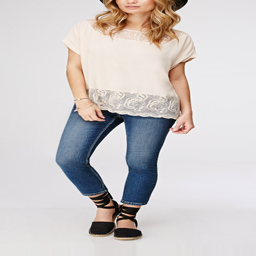
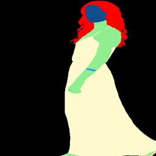
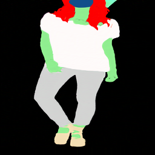
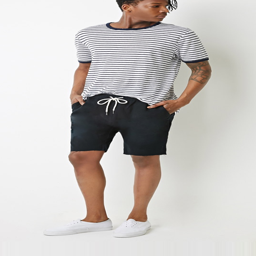
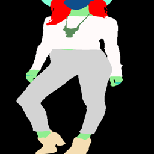
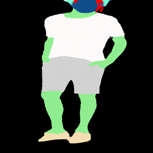
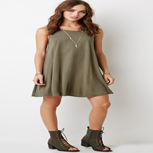
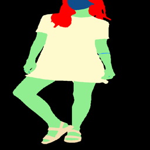
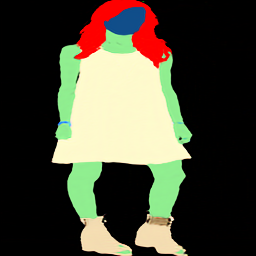
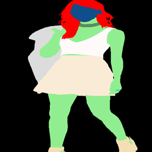

# Contrastive Unpaired Translation (CUT)

PyTorch implementation of unpaired image-to-image translation based on patchwise contrastive learning and adversarial learning, which was originally introduced by Taesung Park, on **Deepfashion** dataset from Kaggle. This model training is faster and less memory-intensive. In addition, this method can be extended to single image training, where each “domain” is only a *single* image.

[Contrastive Learning for Unpaired Image-to-Image Translation](http://taesung.me/ContrastiveUnpairedTranslation/)  

## Example Results

### Unpaired Image-to-Image Translation
| Real A        | Real B        | Fake B       |
|--------------|---------------|--------------|
|  |  |  |
|  |  |  |
|  |  |  |
|  |  |  |


## Prerequisites
- Linux or macOS
- Python 3
- CPU or NVIDIA GPU + CUDA CuDNN

### Getting started

- Clone this repo:
```bash
git clone https://github.com/taesungp/contrastive-unpaired-translation CUT
cd CUT
```

- Install PyTorch 1.1 and other dependencies (e.g., torchvision, visdom, dominate, gputil).

  For pip users, please type the command `pip install -r requirements.txt`.

  For Conda users,  you can create a new Conda environment using `conda env create -f environment.yml`.


### CUT and FastCUT Training and Test

- Download the `grumpifycat` dataset (Fig 8 of the paper. Russian Blue -> Grumpy Cats)
```bash
bash ./datasets/download_cut_dataset.sh grumpifycat
```
The dataset is downloaded and unzipped at `./datasets/grumpifycat/`.

- To view training results and loss plots, run `python -m visdom.server` and click the URL http://localhost:8097.

- Train the CUT model:
```bash
python train.py --dataroot ./datasets/grumpifycat --name grumpycat_CUT --CUT_mode CUT
```
 Or train the FastCUT model
 ```bash
python train.py --dataroot ./datasets/grumpifycat --name grumpycat_FastCUT --CUT_mode FastCUT
```
The checkpoints will be stored at `./checkpoints/grumpycat_*/web`.

- Test the CUT model:
```bash
python test.py --dataroot ./datasets/grumpifycat --name grumpycat_CUT --CUT_mode CUT --phase train
```

The test results will be saved to a html file here: `./results/grumpifycat/latest_train/index.html`.

### SinCUT Single Image Unpaired Training

To train SinCUT (single-image translation, shown in Fig 9, 13 and 14 of the paper), you need to

1. set the `--model` option as `--model sincut`, which invokes the configuration and codes at `./models/sincut_model.py`, and
2. specify the dataset directory of one image in each domain, such as the example dataset included in this repo at `./datasets/single_image_monet_etretat/`. 

For example, to train a model for the [Etretat cliff (first image of Figure 13)](https://github.com/taesungp/contrastive-unpaired-translation/blob/master/imgs/singleimage.gif), please use the following command.

```bash
python train.py --model sincut --name singleimage_monet_etretat --dataroot ./datasets/single_image_monet_etretat
```

or by using the experiment launcher script,
```bash
python -m experiments singleimage run 0
```

For single-image translation, we adopt network architectural components of [StyleGAN2](https://github.com/NVlabs/stylegan2), as well as the pixel identity preservation loss used in [DTN](https://arxiv.org/abs/1611.02200) and [CycleGAN](https://github.com/junyanz/pytorch-CycleGAN-and-pix2pix/blob/master/models/cycle_gan_model.py#L160). In particular, we adopted the code of [rosinality](https://github.com/rosinality/stylegan2-pytorch), which exists at `models/stylegan_networks.py`.

The training takes several hours. To generate the final image using the checkpoint,

```bash
python test.py --model sincut --name singleimage_monet_etretat --dataroot ./datasets/single_image_monet_etretat
```

or simply

```bash
python -m experiments singleimage run_test 0
```

### Citation
If you use this code for your research, please cite [paper](https://arxiv.org/pdf/2007.15651).
```
@inproceedings{park2020cut,
  title={Contrastive Learning for Unpaired Image-to-Image Translation},
  author={Taesung Park and Alexei A. Efros and Richard Zhang and Jun-Yan Zhu},
  booktitle={European Conference on Computer Vision},
  year={2020}
}
```
